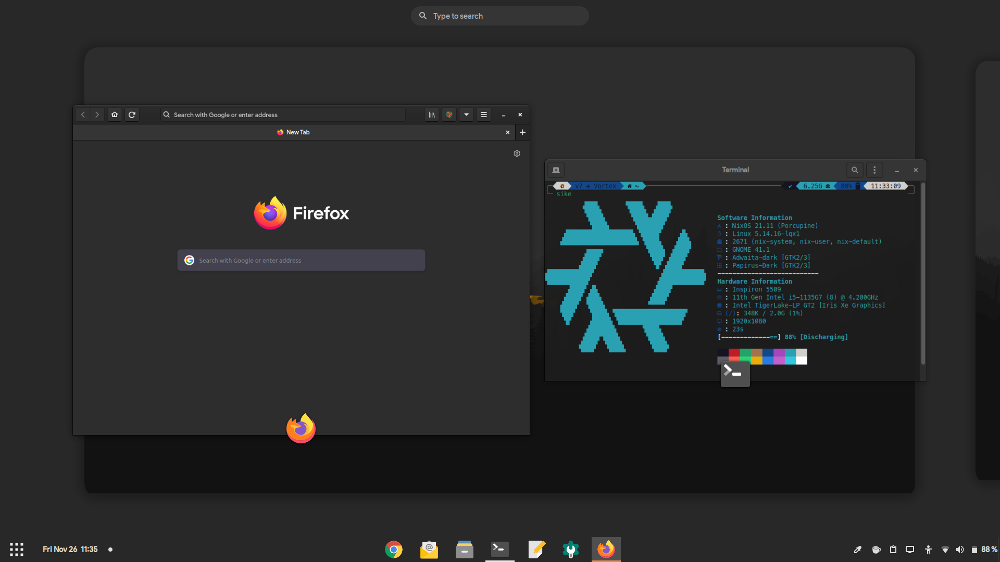

# Dotfiles
![[Logo]](./docs/resources/logo.png)

 [](https://nixos.org)

This [repository](https://gitlab.com/maydayv7/dotfiles) contains the configuration and `dotfiles` for my continuously evolving multi-PC setup (using [Nix](https://nixos.org/))



## Features
[](https://builtwithnix.org)

+ Device-Agnostic
+ Convenient and Automated
+ Hermetically Reproducible
+ Declarative and Derivational
+ Atomic, Generational and Immutable

## Programs
| Type                | Program                                                         |
| :------------------ | :-------------------------------------------------------------: |
| Editor              | [gEdit](https://wiki.gnome.org/Apps/Gedit)                      |
| Shell               | [ZSH](https://www.zsh.org)                                      |
| Terminal            | [GNOME Terminal](https://gitlab.gnome.org/GNOME/gnome-terminal) |
| Browser             | [Firefox](https://www.mozilla.org/en-US/firefox/)               |
| Desktop Environment | [GNOME](https://www.gnome.org)                                  |

## Structure
Here is an overview of the file hierarchy:

```
┌── configuration.nix
├── flake.nix
├── flake.lock
├── .version
├── .templates
├── files
├── devices
├── scripts
├── secrets
├── shells
├── repl.nix
├── packages
│   └── overlays
├── lib
│   ├── build.nix
│   ├── map.nix
│   ├── pack.nix
│   └── xdg.nix
└── modules
    ├── apps
    ├── base
    ├── gui
    ├── hardware
    ├── nix
    ├── shell
    └── user
```

+ `configuration.nix`: main system configuration file
+ `flake.nix`: repository version control using `inputs`
+ `.version`: system state version
+ `.templates`: custom Flakes configuration templates
+ `files`: `dotfiles` and program configuration
+ `devices`: system configuration for various devices
+ `scripts`: useful system management scripts
+ `secrets`: authentication credentials management using [`sops-nix`](https://github.com/Mic92/sops-nix)
+ `shells`: sandboxed shells for development purposes
+ `repl.nix`: interactive shell to explore syntax and configuration
+ [`packages`](./docs/PACKAGES.md): locally built custom packages
+ `overlays`: overrides for pre-built packages
+ [`lib`](./docs/LIBRARY.md): custom functions designed for conveniently defining configuration
+ [`modules`](./docs/MODULES.md): custom configuration modules for additional functionality

## Installation
<details>
<summary><b>From Scratch</b></summary>

Download the latest NixOS `.iso` from the [Releases](../../Releases) page and burn it to a USB using a flashing utility such as [Etcher](https://www.balena.io/etcher/)  
If Nix is already installed on your system, you may run the following command to build the Install Media:  
*Replace* ***VARIANT*** *with the name of install media to create*
<pre><code>nix build gitlab:maydayv7/dotfiles#installMedia.<b><i>VARIANT</i></b>.config.system.build.isoImage</code></pre>

#### Partition Scheme
*Note that the `nixos-install-device` script automatically creates and labels all the required partitions, so it is recommended that only the partition table on the disk be created and have enough free space*

| Name           | Label  | Format     | Size (minimum) |
| :------------- | :----: | :--------: | :------------: |
| BOOT Partition | ESP    | vfat       | 500M           |
| ROOT Partition | System | ext4/BTRFS | 25G            |
| SWAP Area      | swap   | swap       | 8G             |
| DATA Partition | Files  | NTFS       | 10G            |

#### Procedure
To install the OS, just boot the Live USB and run `sudo nixos-install-device`  
In case you have downloaded the NixOS `.iso` from [here](https://nixos.org/download.html), then you can use the following commands:

```
nix build gitlab:maydayv7/dotfiles#packages.x86_64-linux.install
sudo ./result/bin/nixos-install-device
```

*If the image doesn't boot, try disabling the `secure boot` and `RAID` options from `BIOS`*  
After the reboot, run `nixos-setup` in the newly installed system to finish setup
*In case you are using the `advanced` filesystem scheme, you may need to set the boot flag `zfs_force=1` on first boot*
</details>

<details>
<summary><b>Already Installed</b></summary>

In case you want to use my configuration as-is for a fresh NixOS install, you can try the following steps:

1. Clone this repository (`git` and `git-crypt` must be installed) to `/etc/nixos`: <pre><code>sudo mkdir /etc/nixos
sudo chown $USER /etc/nixos
sudo chmod ugo+rw /etc/nixos
git clone https://gitlab.com/maydayv7/dotfiles /etc/nixos
cd /etc/nixos && git remote rm origin
rm -r .git-crypt files/gpg/{pubring.kbx,private-keys-v1.d}
</code></pre>

2. Install `gnupg` and generate a GPG Key for yourself (if you don't already have one), and include it in the [`.sops.yaml`](../secrets/.sops.yaml) file (using `gpg --list-keys`). You can use the following commands to generate the GPG key (Ultimate trust and w/o passphrase is preferred):  
*Replace* ***USER*** *,* ***EMAIL*** *and* ***COMMENT*** <pre><code>gpg --full-generate-key
1
4096
0
y
<b><i>USER
EMAIL
COMMENT</i></b>
O
</code></pre>

3. Authenticate `git-crypt` using your GPG keys using the command `git-crypt add-gpg-user` and copy the `$HOME/.gnupg` directory to `files/gpg`

4. Make new `secrets` and `passwords` in the desired directories by appending the paths to `.sops.yaml` and then using the following command:  
*Replace* ***PATH*** *with the path to the `secret`* <pre><code>sops --config /etc/nixos/secrets/.sops.yaml -i <b><i>PATH</i></b></code></pre>

5. Add device-specific configuration by creating a new file in [`devices`](./devices) (bear in mind that the name of the file must be same as the `HOSTNAME` of your device), and if required, hardware configuration using the `hardware.modules` option

6. Finally, run `nixos-rebuild switch --flake /etc/nixos#HOSTNAME` (as `root`) to switch to the configuration!
</details>

<details>
<summary><b>Build It Yourself</b></summary>

If you really want to get dirty with Nix and decide to invest oodles of your time into building your own configuration, this repository can be used as inspiration. For starters, you can run `nix flake init -t gitlab:maydayv7/dotfiles#minimal` in `/etc/nixos` for a basic Flakes-compatible system configuration. If you have any doubts, feel free to open an issue. You can check out [this](./docs/LINKS.md) document which contains a list of links to resourceful Nix documentation/tutorials/projects that may be helpful in your endeavour

**Welcome** to the Nix Community! ;)

</details>

## Notes
#### Caution
I am pretty new to Nix, and my configuration is still *WIP* and uses Nix [Flakes](https://nixos.wiki/wiki/Flakes), an experimental feature (**Important:** Nix >= 2.4). If you have any doubts or suggestions, feel free to open an [issue](https://gitlab.com/maydayv7/dotfiles/-/issues/new)

#### Requirements
*May change according to available hardware*  
+ UEFI Compatible System
+ Intel CPU + iGPU

#### License
The files and scripts in this repository are licensed under the very permissive MIT [License](./LICENSE), allowing you to freely use, modify, copy, distribute, sell or give away the software, only requirement being that the license and copyright notice must be provided with it

***Caution:*** This repository may contain proprietary [fonts](./files/fonts) and [wallpapers](./files/wallpapers) which do not come under the above-mentioned license

#### Branches
There are two branches, [`stable`](../../tree/stable) and [`develop`](../../tree/develop) (when required). The `stable` branch can be used at any time, and consists of configuration that builds without failure, but the `develop` branch is a bleeding-edge testbed, and is not recommended to be used. Releases are always made from the `stable` branch after extensive testing

See the [docs](./docs/README.md) for additional information
