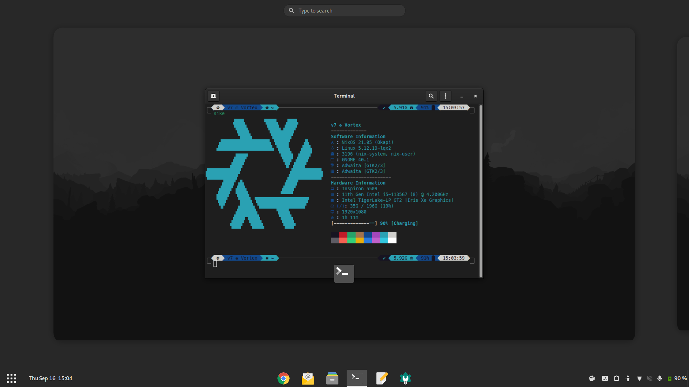

# My NixOS Setup
This repo contains the configuration files for my continuously evolving personal multi-pc NixOS 21.05 setup

I am pretty new to Nix, and my configuration is still WIP. If you have any doubts or suggestions, feel free to open an issue



## Programs
| Type                | Program                     |
| :------------------ | :-------------------------: |
| Editor              | [gEdit](https://wiki.gnome.org/Apps/Gedit) |
| Shell               | [ZSH](https://www.zsh.org) |
| Terminal            | [GNOME Terminal](https://gitlab.gnome.org/GNOME/gnome-terminal) |
| Desktop Environment | [GNOME](https://www.gnome.org) |

## Structure

Here is an overview of the folders' structure:

```
┌── configuration.nix
├── device.nix
├── secrets
├── src
│   └── setup.sh
├── overlays
│   ├── packages
│   └── patches
├── volatile
│   ├── repos
│   └── path
├── users
│   ├── v7
│   │   ├── config
│   │   ├── modules
│   │   └── overlays
│   └── root
└── modules
    ├── devices
    │   ├── vortex
    │   │   ├── hardware.nix
    │   │   ├── boot.nix
    │   │   └── services.nix
    │   └── futura
    │       ├── hardware.nix
    │       └── boot.nix
    ├── gui.nix
    ├── partitions.nix
    ├── packages.nix
    └── programs.nix
```

- `configuration.nix`: main system derivation file
- `setup.sh`: initial setup and installation script
- `device.nix`: device-specific configuration, generated by setup script
- `path`: path to system configuration files, generated by setup script
- `volatile`: directory containing periodically variable information
- `repos`: management and versioning for package repositories
- `users`: user related configuration and dotfiles
- `modules`: modulated configuration for easier management
- `overlays`: overrides for pre-built packages
- `packages`: locally built custom packages

## Installation
Install NixOS using the following commands:  
*Note that the partition label along with the `esp` and `boot` flags must be set on the EFI System Partition*
<pre><code>mkfs.ext4 -L System <i>/path/to/root</i>
mkswap -L swap <i>/path/to/swap</i>
mkfs.fat -F 32 -n boot <i>/path/to/esp</i>
mount /dev/disk/by-label/System /mnt
mkdir -p /mnt/boot/efi
mount /dev/disk/by-partlabel/boot /mnt/boot/efi
nixos-generate-config --root /mnt
nixos-install
</code></pre>

After rebooting, run the following commands:
<pre><code>git clone --recurse-submodules https://github.com/maydayv7/nixos-config.git && cd nixos-config
git-crypt unlock <i>/path/to/key</i>
chmod +x src/setup.sh && ./src/setup.sh
</code></pre>
And follow the instructions to setup and rebuild the system

## Notes
#### Requirements
- Intel CPU + iGPU
- UEFI System (for use with GRUB EFI Bootloader)

#### Encryption
The contents of `secrets` is encrypted is using `git-crypt`. It is the location where any sensitive information and authentication credentials are stored

#### Credentials
Passwords are made using the command `mkpasswd -m sha-512` and then specified using the `hashedPassword` or by specifying the path to the plain text file containing the hashed password using the `passwordFile` option (which I have done by placing passwords in `/etc/passwords`). GPG Keys have to be externally imported (for security purposes)

#### Theming
- [Neofetch](https://github.com/dylanaraps/neofetch): Snazzy CLI System Information Tool
- [Powerlevel10K](https://github.com/romkatv/powerlevel10k): P10K ZSH Theme for the fancy-looking prompt using custom configuration
- [Firefox GNOME Theme](https://github.com/rafaelmardojai/firefox-gnome-theme): GNOME Theme for the Mozilla Firefox Browser, used for better desktop integration, submodule imported at `users/v7/config/firefox/`

#### Important Links

- [NixOS Manual](https://nixos.org/manual/nixpkgs/stable)
- [NixOS Discourse](https://discourse.nixos.org/)
- [NixOS Package Search](https://search.nixos.org/)
- [Nixpkgs Repository](https://github.com/NixOS/nixpkgs)
- [Nix User Repository](https://github.com/nix-community/NUR)
- [Home Manager Options](https://rycee.gitlab.io/home-manager/options.html)