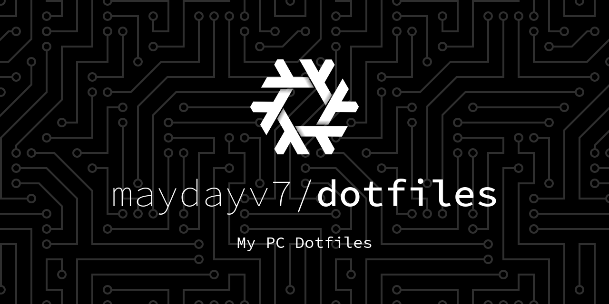
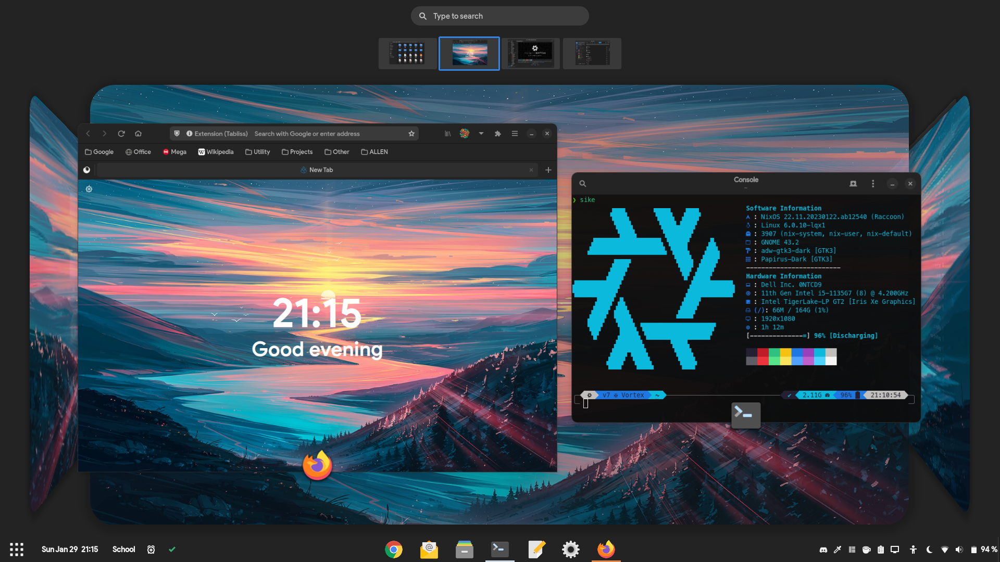

   [](https://nixos.org)  

This [repository](https://github.com/maydayv7/dotfiles) contains the configuration and `dotfiles` for my continuously evolving multi-PC setup (using [Nix](https://nixos.org/))



## Features
[](https://builtwithnix.org)

+ Device-Agnostic
+ Convenient and Automated
+ Hermetically Reproducible
+ Declarative and Derivational
+ Atomic, Generational and Immutable

## Programs
| Type                | Program                                                         |
| :------------------ | :-------------------------------------------------------------: |
| Editor              | [gEdit](https://wiki.gnome.org/Apps/Gedit)                      |
| Shell               | [ZSH](https://www.zsh.org)                                      |
| Terminal            | [GNOME Terminal](https://gitlab.gnome.org/GNOME/gnome-terminal) |
| Browser             | [Firefox](https://www.mozilla.org/en-US/firefox/)               |
| Desktop Environment | [GNOME](https://www.gnome.org)                                  |

## Structure
***Overview of File Hierarchy***

<details>
<summary><b>Outputs</b></summary>

```shellsession
$ nix flake show
github:maydayv7/dotfiles
├───apps
│   └───x86_64-linux
│       └───nixos: app
├───channels: unknown
├───checks
│   └───x86_64-linux
│       ├───Device-gnome: derivation 'nixos-rebuild'
│       └───commit: derivation 'pre-commit-run'
├───defaultApp
│   └───x86_64-linux: app
├───defaultPackage
│   └───x86_64-linux: package 'Dotfiles-v5.0'
├───defaultTemplate: template: Simple, Minimal NixOS Configuration
├───devShell
│   └───x86_64-linux: development environment 'devShell'
├───devShells
│   └───x86_64-linux
│       ├───java: development environment 'Java'
│       └───video: development environment 'Video'
├───files: unknown
├───installMedia: unknown
├───legacyPackages
│   └───x86_64-linux: omitted (use '--legacy' to show)
├───lib: unknown
├───nixosConfigurations
│   ├───Futura: NixOS configuration
│   └───Vortex: NixOS configuration
├───nixosModule: NixOS module
├───nixosModules
│   ├───apps: NixOS module
│   ├───base: NixOS module
│   ├───gui: NixOS module
│   ├───hardware: NixOS module
│   ├───nix: NixOS module
│   ├───secrets: NixOS module
│   ├───shell: NixOS module
│   └───user: NixOS module
├───overlays
│   └───nixFlakes: Nixpkgs overlay
├───packages
│   └───x86_64-linux
│       ├───dotfiles: package 'Dotfiles-v5.0'
│       └───fonts: package 'fonts-7'
└───templates
    ├───extensive: template: My Complete, Extensive NixOS Configuration
    └───minimal: template: Simple, Minimal NixOS Configuration
```

+ `checks`: custom configuration checks
+ `channels`: configured system package repositories

</details>

```
┌── configuration.nix
├── flake.nix
├── flake.lock
├── .version
├── .templates
├── files
├── devices
├── secrets
├── shells
├── repl.nix
├── users
├── scripts
│   └── nixos.nix
├── packages
│   └── overlays
├── lib
│   ├── build.nix
│   ├── map.nix
│   ├── pack.nix
│   ├── types.nix
│   └── xdg.nix
└── modules
    ├── apps
    ├── base
    ├── gui
    ├── hardware
    ├── nix
    ├── shell
    └── user
        ├── passwords
        └── home
```

+ `configuration.nix`: main system configuration file
+ `flake.nix`: repository version control using `inputs`
+ `.version`: system state version
+ [`.templates`](./templates/README.md): custom Flakes configuration templates
+ [`files`](./files/README.md): `dotfiles` and program configuration
+ [`devices`](./devices/README.md): system configuration for various devices
+ [`secrets`](./secrets/README.md): authentication credentials management using [`sops-nix`](https://github.com/Mic92/sops-nix)
+ `shells`: sandboxed shells for development purposes
+ `repl.nix`: interactive shell to explore syntax and configuration
+ [`users`](./users/README.md): individual user-specific configuration
+ [`scripts`](./scripts/README.md): useful system management scripts
+ [`packages`](./packages/README.md): locally built custom packages
+ `overlays`: overrides for pre-built packages
+ [`lib`](./lib/README.md): custom functions designed for conveniently defining configuration
+ [`modules`](./modules/README.md): custom configuration modules for additional functionality

## Installation

<details>
<summary><b>Already Installed</b></summary>

In case you want to use my configuration as-is for a fresh NixOS install, you can try the following steps:

1. Clone this repository (`git` and `git-crypt` must be installed) to `/etc/nixos`: <pre><code>sudo mkdir /etc/nixos
sudo chown $USER /etc/nixos && sudo chmod ugo+rw /etc/nixos
cd /etc/nixos && nix flake init -t github:maydayv7/dotfiles#extensive
</code></pre>

2. Install `gnupg` and generate a GPG Key for yourself (if you don't already have one), and include it in the [`.sops.yaml`](./secrets/.sops.yaml) file (using `gpg --list-keys`). You can use the following commands to generate the GPG key (Ultimate trust and w/o passphrase is preferred):  
*Replace* ***USER*** *,* ***EMAIL*** *and* ***COMMENT*** <pre><code>gpg --full-generate-key
1
4096
0
y
<b><i>USER
EMAIL
COMMENT</i></b>
O
gpg --output public.pgp --armor --export <b><i>USER</i></b>@<b><i>EMAIL</i></b>
gpg --output private.pgp --armor --export-secret-key <b><i>USER</i></b>@<b><i>EMAIL</i></b>
</code></pre>
*Save the keys `public.gpg` and `private.gpg` in a secure location*

3. Authenticate `git-crypt` using your GPG keys using the command `git-crypt add-gpg-user` and copy the `$HOME/.gnupg` directory to `files/gpg` after performing the following commands: <pre><code>git remote rm origin
rm -r .git-crypt files/gpg/{pubring.kbx,private-keys-v1.d}
</code></pre>

4. Make new `secrets` and `passwords` in the desired directories by appending the paths to `.sops.yaml` and then using the following command:  
*Replace* ***PATH*** *with the path to the `secret`* <pre><code>sops --config /etc/nixos/secrets/.sops.yaml -i <b><i>PATH</i></b></code></pre>

5. Add device-specific configuration by creating a new file in [`devices`](./devices) (bear in mind that the name of the file must be same as the `HOSTNAME` of your device), and if required, hardware configuration using the `hardware.modules` option

6. Finally, run `nixos-rebuild switch --flake /etc/nixos#HOSTNAME` (as `root`) to switch to the configuration!

</details>

<details>
<summary><b>From Scratch</b></summary>

Download the latest NixOS `.iso` from the [Releases](../../releases/latest) page and burn it to a USB using a flashing utility such as [Etcher](https://www.balena.io/etcher/)  

***Important:*** In order to use the configuration, you must first create a clone of this repository and follow steps 2 to 5 from the above section, and preferably upload it to a hosting platform

<details>
<summary><i>Additional Install Media</i></summary>

If Nix is already installed on your system, you may run the following command to build the Install Media:  
*Replace* ***VARIANT*** *with the name of Install Media to create*
<pre><code>nix build github:maydayv7/dotfiles#installMedia.<b><i>VARIANT</i></b>.config.system.build.isoImage</code></pre>

You can also download the NixOS `.iso` from [here](https://nixos.org/download.html) and run the install script using the following command (as `root`):

```
nix run github:maydayv7/dotfiles#nixos -- install
```

If you want to create an `.iso` image of the entire system, run the following command:  
*Replace* ***DEVICE*** *with the name of Device to build*  
<pre><code>nix run github:nix-community/nixos-generators -- -f iso --flake github:maydayv7/dotfiles#<b><i>DEVICE</i></b></code></pre>

</details>

#### Partition Scheme
*Note that the install script automatically creates and labels all the required partitions, so it is recommended that only the partition table on the disk be created and have enough free space*

| Name           | Label  | Format     | Size (minimum) |
| :------------- | :----: | :--------: | :------------: |
| BOOT Partition | ESP    | vfat       | 500M           |
| ROOT Partition | System | ext4/BTRFS | 25G            |
| SWAP Area      | swap   | swap       | 8G             |
| DATA Partition | Files  | NTFS       | 10G            |

#### Procedure
To install the OS, just boot the Live USB and run `sudo nixos install`  
*If the image doesn't boot, try disabling the `secure boot` and `RAID` options from `BIOS`*  
After the reboot, run `nixos setup` in the newly installed system to finish setup  
*In case you are using the `advanced` filesystem scheme, you may need to set the boot flag `zfs_force=1` on first boot*

</details>

<details>
<summary><b>Automatic Deploy</b></summary>

The `nixosConfigurations` support automatic deployments using [deploy-rs](https://github.com/serokell/deploy-rs)

To deploy a Device, simply run the following command:  
*Replace* ***DEVICE*** *with the name of Device to deploy*
<pre><code>nix run github:serokell/deploy -- github:maydayv7/dotfiles#<b><i>DEVICE</i></b></code></pre>

</details>

<details>
<summary><b>Build It Yourself</b></summary>

If you really want to get dirty with Nix and decide to invest oodles of your time into building your own configuration, this repository can be used as inspiration. For starters, you can run `nix flake init -t github:maydayv7/dotfiles` in `/etc/nixos` for a basic Flakes-compatible system configuration. If you have any doubts, feel free to open an issue. You can check out the list of links below to resourceful Nix documentation/tutorials/projects that may be helpful in your endeavour

**Welcome** to the Nix Community! ;)

</details>

## Notes
#### Caution
I am pretty new to Nix, and my configuration is still *WIP* and uses Nix [Flakes](https://nixos.wiki/wiki/Flakes), an experimental feature (**Important:** Nix >= 2.4)

It is not recommended to use NixOS if you are a beginner just starting out, without acquaintance with either the command-line or functional programming languages, since the learning curve is steep, debugging issues is difficult, documentation is shallow, and the effort required/time spent isn't worth the hassle for a novice/casual user

If you have any doubts or suggestions, feel free to open an [issue](../../issues/new/choose)

### Requirements
*May change according to available hardware*  
+ UEFI Compatible System
+ Intel CPU + iGPU

### License
The files and scripts in this repository are licensed under the very permissive MIT [License](./LICENSE), allowing you to freely use, modify, copy, distribute, sell or give away the software, only requirement being that the license and copyright notice must be provided with it

### Branches
There are two branches, [`stable`](../../tree/stable) and [`develop`](../../tree/develop) (when required). The `stable` branch can be used at any time, and consists of configuration that builds without failure, but the `develop` branch is a bleeding-edge testbed, and is not recommended to be used. Releases are always made from the `stable` branch after extensive testing

### Build
While rebuilding system with Flakes, make sure that any file with unstaged changes will not be included. Use `git add .` in cases where the `git` tree is dirty

#### Cache
The system build cache is publicly hosted using [Cachix](https://www.cachix.org) at [maydayv7-dotfiles](https://app.cachix.org/cache/maydayv7-dotfiles), and can be used while building the system to prevent rebuilding from scratch

#### Continuous Integration
This repository makes use of [`Github Actions`](./.github/workflows) in order to automatically check the configuration syntax on every commit (using [`nix-linter`](https://github.com/Synthetica9/nix-linter)) and format it (using [`nixfmt`](https://github.com/serokell/nixfmt)), update the `inputs` every week, build the configuration and upload the build cache to [Cachix](https://app.cachix.org/cache/maydayv7-dotfiles) as well as publish the Install Media `.iso` to a draft Release upon creation of a tag (You can also find `GitLab CI/CD` configuration in [`.gitlab`](./.gitlab/.gitlab-ci.yml)). A `git` [hook](./.git-hooks) is used to check the commit message to adhere to the [`Conventional Commits`](https://www.conventionalcommits.org) specification

###### Variables
+ [`ACCESS_TOKEN`](./modules/apps/git/secrets/gitlab-token.secret): Personal Access Token (To create one - [GitHub](https://docs.github.com/en/authentication/keeping-your-account-and-data-secure/creating-a-personal-access-token), [GitLab](https://docs.gitlab.com/ee/user/profile/personal_access_tokens.html))
+ [`CACHIX_TOKEN`](./secrets/cachix-token.secret): Cachix Authentication Token

### File System
The system may be set up using either a `simple` or `advanced` filesystem layout. The advanced ZFS opt-in state filesystem configuration allows for a vastly improved experience, preventing formation of cruft and exerting total control over the device state, by erasing the system at every boot, keeping only what's required

#### Data Storage
All important, persisted user files are stored at `/data`. Personal files and media are stored on an NTFS partition mounted to `/data/files`

## Links
### Theming
+ [Neofetch](https://github.com/dylanaraps/neofetch): Snazzy CLI System Information Tool
+ [Powerlevel10K](https://github.com/romkatv/powerlevel10k) Theme: ZSH Theme for the fancy-looking prompt with immense customization capabilities
+ [Dash to Panel](https://github.com/home-sweet-gnome/dash-to-panel): GNOME Shell Extension providing a highly customizable icon taskbar for maximized productivity
+ [DNOME](https://github.com/GeopJr/DNOME) Discord Theme: Discord theme inspired by Adwaita, designed to integrate Discord with GNOME
+ [Firefox GNOME Theme](https://github.com/rafaelmardojai/firefox-gnome-theme): GNOME Theme for the Mozilla Firefox Browser, used for better desktop integration

### Important Links
+ Official [Documentation](https://nixos.org/learn.html)
+ NixOS [Manual](https://nixos.org/manual/nixpkgs/stable)
+ Nix [Pills](https://nixos.org/guides/nix-pills/)
+ NixOS [Discourse](https://discourse.nixos.org/)
+ NixOS [Package Search](https://search.nixos.org/)
+ [`nixpkgs`](https://github.com/NixOS/nixpkgs) Package Repository
+ [NUR](https://github.com/nix-community/NUR) Nix User Repository
+ NixOS [Hardware Modules](https://github.com/nixos/hardware)
+ Home Manager [Options](https://nix-community.github.io/home-manager/options.html)
+ [`sops`](https://github.com/Mic92/sops-nix) Module
+ [`impermanence`](https://github.com/nix-community/impermanence) Module
+ [`flake-utils-plus`](https://github.com/gytis-ivaskevicius/flake-utils-plus) Helper Functions
+ [`nixos-generators`](https://github.com/nix-community/nixos-generators) Image Generation Modules
+ [`deploy-rs`](https://github.com/serokell/deploy-rs) Automatic Deployment Tool

#### Other Sources
+ Tweag [Article](https://www.tweag.io/blog/2020-05-25-flakes/) introducing Flakes
+ Serokell's [Blog](https://serokell.io/blog/practical-nix-flakes) on Flakes
+ Jordan Isaac's [Blog](https://jdisaacs.com/series/nixos-desktop/) for porting configuration to Flakes
+ Jon Ringer's [Videos](https://www.youtube.com/channel/UC-cY3DcYladGdFQWIKL90SQ) on General NixOS Tooling and Hackery
+ Justin's [Notes](https://github.com/justinwoo/nix-shorts) on using Nix
+ Lan Tian's Series of [Blog Posts](https://lantian.pub/en/article/modify-website/nixos-initial-config-flake-deploy.lantian/) on NixOS
+ Christine's [Blog Posts](https://christine.website/blog/series/nixos) addressing NixOS Security
+ [Graham](https://grahamc.com/blog/erase-your-darlings) and [Elis'](https://elis.nu/blog/2020/05/nixos-tmpfs-as-root/) Blog Posts on Ephemeral Partition Schemes

#### Other Configurations
Here are some repositories that I may have shamelessly rummaged through for building my `dotfiles`:  
*Thanks a lot! ;)*
+ Over-Engineered [Configuration](https://github.com/divnix/devos) to scare off Beginners
+ Minimalistic [Configuration](https://github.com/colemickens/nixos-flake-example) for scared Beginners
+ User Configurations -
  * [balsoft](https://code.balsoft.ru/balsoft/nixos-config)
  * [bbigras](https://github.com/bbigras/nix-config)
  * [cole-h](https://github.com/cole-h/nixos-config/)
  * [colemickens](https://github.com/cole-mickens/nixcfg)
  * [davidtwco](https://github.com/davidtwco/veritas)
  * [gvolpe](https://github.com/gvolpe/nix-config)
  * [hlissner](https://github.com/hlissner/dotfiles)
  * [jordanisaacs](https://github.com/jordanisaacs/dotfiles)
  * [kclejeune](https://github.com/kclejeune/system)
  * [lovesegfault](https://github.com/lovesegfault/nix-config)
  * [lucasew](https://github.com/lucasew/nixcfg)
  * [nobbz](https://github.com/NobbZ/nixos-config)
  * [rasendubi](https://github.com/rasendubi/dotfiles)
  * [vlaci](https://github.com/vlaci/nixos-config)
  * [wiltaylor](https://github.com/wiltaylor/dotfiles)

------------------------------------------------------------------
[**Changelog**](./CHANGELOG.md)  
[**Known Issues**](./LIMITATIONS.md)

You can navigate to the `README`'s present in the various directories to know more about them

> Last Updated: **February** 2022

**V 7**  
<maydayv7@gmail.com>