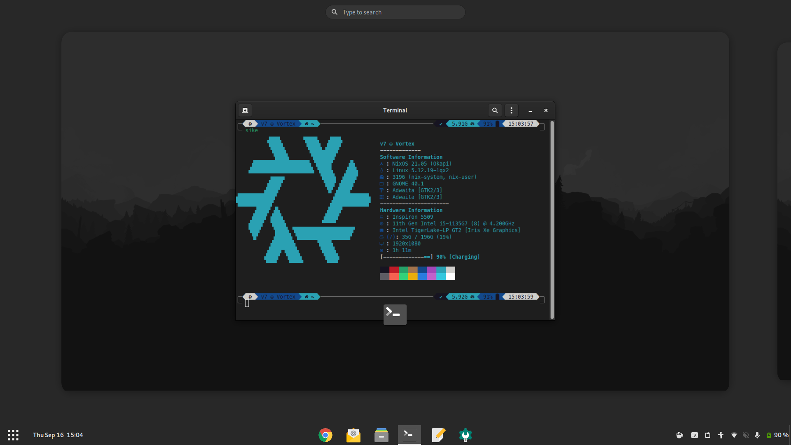

# My NixOS Setup
This repo contains the configuration files for my personal NixOS setup



### Programs
| Type                | Program                     |
| :-----------------: | :-------------------------: |
| Editor              | [gEdit](https://neovim.io/) |
| Shell               | [ZSH](https://www.zsh.org/) |
| Terminal            | [GNOME Terminal](https://gitlab.gnome.org/GNOME/gnome-terminal) |
| Desktop Environment | [GNOME](https://www.gnome.org/) |

## Structure

Here is an overview of the folders' structure:

```
├── setup.sh
├── configuration.nix
├── repos
├── overlays
├── secrets
├── users
│   ├── v7
│       ├── config
│       ├── modules
│       ├── overlays
│   ├── root
└── modules
    ├── boot.nix
    ├── gui.nix
    ├── hardware.nix
    ├── packages.nix
    └── programs.nix
```

- `setup.sh`: the initial setup and installation script.
- `configuration.nix`: main system derivation file.
- `users`: user related configuration and dotfiles.
- `repos`: management and versioning for additional repos.
- `modules`: modulated configuration for easier management.
- `overlays`: locally built package overrides.

### Install
Install NixOS using the default generated `configuration.nix`  
After rebooting, run the following commands:
<pre><code>mkdir temp && cd temp
git clone https://github.com/maydayv7/nixos-config.git && cd nixos-config
git-crypt unlock <i>/path/to/key</i>
chmod +x setup.sh && ./setup.sh
</code></pre>