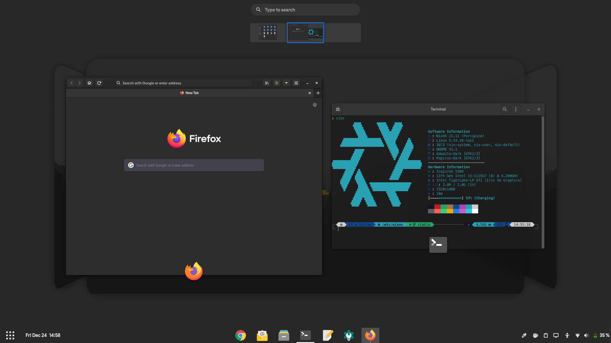

# Dotfiles
![[Logo]](https://socialify.git.ci/maydayv7/dotfiles/image?description=1&font=Source%20Code%20Pro&logo=https%3A%2F%2Fraw.githubusercontent.com%2FNixOS%2Fnixos-artwork%2F9bd73014f75c2ce97d104c78314d78eb2493e24d%2Flogo%2Fwhite.svg&name=1&owner=1&pattern=Circuit%20Board&theme=Dark)

   [](https://nixos.org)  

This repo contains the configuration files for my continuously evolving multi-PC setup



## Features
[](https://builtwithnix.org)

+ Device-Agnostic
+ Convenient and Automated
+ Hermetically Reproducible
+ Declarative and Derivational
+ Atomic, Generational and Immutable

## Programs
| Type                | Program                     |
| :------------------ | :-------------------------: |
| Editor              | [gEdit](https://wiki.gnome.org/Apps/Gedit) |
| Shell               | [ZSH](https://www.zsh.org) |
| Terminal            | [GNOME Terminal](https://gitlab.gnome.org/GNOME/gnome-terminal) |
| Browser             | [Firefox](https://www.mozilla.org/en-US/firefox/) |
| Desktop Environment | [GNOME](https://www.gnome.org) |

## Structure
Here is an overview of the file hierarchy:

```
── dotfiles ──┐ 
 ┌── configuration.nix
 ├── flake.nix
 ├── flake.lock
 ├── packages
 ├── overlays
 ├── shells
 ├── lib
 │   ├── device
 │   └── user
 ├── scripts
 │   ├── setup
 │   ├── install
 │   └── management
 ├── roles
 │   ├── device
 │   └── user
 ├── modules
 │   ├── device
 │   │   ├── base
 │   │   ├── gui
 │   │   └── hardware
 │   └── user
 │       ├── dotfiles
 │       ├── keys
 │       └── shell
 └── secrets ──┐
         ┌── cachix
         ├── gpg
         ├── ssh
         └── passwords
```

+ `configuration.nix`: main system configuration file
+ `flake.nix`: repository version control using `inputs`
+ `packages`: locally built custom packages
+ `overlays`: overrides for pre-built packages
+ `shells`: sandboxed shells for development purposes
+ `lib`: custom functions designed for conveniently defining device and user configuration
+ `scripts`: useful system management scripts
+ `roles`: modulated role-based configuration for effortlessly managing workflows
+ `modules`: custom configuration modules for additional functionality
+ `device`: device and install media specific configuration
+ `user`: user related configuration and dotfiles
+ `secrets`: private `git` repository containing authentication credentials

## Installation
Download the NixOS `.iso` from the [Releases](https://github.com/maydayv7/dotfiles/releases/latest) page, then burn it to a USB using [Etcher](https://www.balena.io/etcher/). If Nix is already installed on your system, you may run the following command to build the Install Media:  
*Replace* ***VARIANT*** *with the name of install media to create*
<pre><code>nix build github:maydayv7/dotfiles#installMedia.<b><i>VARIANT</i></b>.config.system.build.isoImage
</code></pre>

#### Partition Scheme
*Note that the `install` script automatically creates and labels all the required partitions, so it is recommended that only the partition table on the disk be created and have enough free space*

| Name           | Label  | Format     | Size (minimum) |
| :------------- | :----: | :--------: | :------------: |
| BOOT Partition | ESP    | vfat       | 500M           |
| ROOT Partition | System | ext4/BTRFS | 25G            |
| SWAP Area      | swap   | swap       | 8G             |
| DATA Partition | Files  | NTFS       | 10G            |

#### Procedure
To install the OS, just boot the Live USB and run `sudo install`  
*In case it doesn't boot, try disabling the `secure boot` and `RAID` options from `BIOS`*  
After the reboot, run `setup` in the newly installed system to finish setup

## Notes
#### Caution
I am pretty new to Nix, and my configuration is still *WIP* and uses Nix [Flakes](https://nixos.wiki/wiki/Flakes), an experimental feature. If you have any doubts or suggestions, feel free to open an issue

#### Requirements
*May change according to available hardware*  
+ UEFI Compatible System
+ Intel CPU + iGPU

#### Branches
There are two branches, `stable` and `develop`. The `stable` branch can be used at any time, and consists of configuration that builds without failure, but the `develop` branch is a bleeding-edge testbed, and is not recommended to be used. Releases are always made from the `stable` branch after it has been extensively tested

See the [docs](./docs/README.md) directory for additional information about my dotfiles