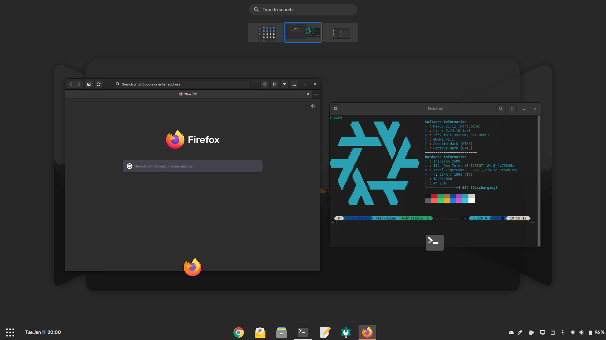

# Dotfiles
![[Logo]](https://socialify.git.ci/maydayv7/dotfiles/image?description=1&font=Source%20Code%20Pro&logo=https%3A%2F%2Fraw.githubusercontent.com%2FNixOS%2Fnixos-artwork%2F9bd73014f75c2ce97d104c78314d78eb2493e24d%2Flogo%2Fwhite.svg&name=1&owner=1&pattern=Circuit%20Board&theme=Dark)

   [](https://nixos.org)  

This repo contains the configuration files for my continuously evolving multi-PC setup



## Features
[](https://builtwithnix.org)

+ Device-Agnostic
+ Convenient and Automated
+ Hermetically Reproducible
+ Declarative and Derivational
+ Atomic, Generational and Immutable

## Programs
| Type                | Program                     |
| :------------------ | :-------------------------: |
| Editor              | [gEdit](https://wiki.gnome.org/Apps/Gedit) |
| Shell               | [ZSH](https://www.zsh.org) |
| Terminal            | [GNOME Terminal](https://gitlab.gnome.org/GNOME/gnome-terminal) |
| Browser             | [Firefox](https://www.mozilla.org/en-US/firefox/) |
| Desktop Environment | [GNOME](https://www.gnome.org) |

## Structure
Here is an overview of the file hierarchy:

```
┌── configuration.nix
├── flake.nix
├── flake.lock
├── .version
├── files
├── scripts
├── secrets
├── shells
├── repl.nix
├── packages
│   └── overlays
├── lib
│   ├── map.nix
│   ├── package.nix
│   └── xdg.nix
└── modules
    ├── apps
    ├── base
    ├── gui
    ├── hardware
    ├── iso
    ├── nix
    ├── shell
    └── user
```

+ `configuration.nix`: main system configuration file
+ `flake.nix`: repository version control using `inputs`
+ `.version`: system state version
+ `files`: dotfiles and program configuration
+ `scripts`: useful system management scripts
+ `secrets`: authentication credentials management using [`sops-nix`](https://github.com/Mic92/sops-nix)
+ `shells`: sandboxed shells for development purposes
+ `repl.nix`: interactive shell to explore syntax and configuration
+ [`packages`](./docs/PACKAGES.md): locally built custom packages
+ `overlays`: overrides for pre-built packages
+ [`lib`](./docs/LIBRARY.md): custom functions designed for conveniently defining configuration
+ `modules`: custom configuration modules for additional functionality

## Installation
<details>
<summary><b>From Scratch</b></summary>

Download the NixOS `.iso` from the [Releases](https://github.com/maydayv7/dotfiles/releases/latest) page, then burn it to a USB using [Etcher](https://www.balena.io/etcher/). If Nix is already installed on your system, you may run the following command to build the Install Media:  
*Replace* ***VARIANT*** *with the name of install media to create*
<pre><code>nix build github:maydayv7/dotfiles#installMedia.<b><i>VARIANT</i></b>.config.system.build.isoImage</code></pre>

#### Partition Scheme
*Note that the `install` script automatically creates and labels all the required partitions, so it is recommended that only the partition table on the disk be created and have enough free space*

| Name           | Label  | Format     | Size (minimum) |
| :------------- | :----: | :--------: | :------------: |
| BOOT Partition | ESP    | vfat       | 500M           |
| ROOT Partition | System | ext4/BTRFS | 25G            |
| SWAP Area      | swap   | swap       | 8G             |
| DATA Partition | Files  | NTFS       | 10G            |

#### Procedure
To install the OS, just boot the Live USB and run `sudo install`  
*In case it doesn't boot, try disabling the `secure boot` and `RAID` options from `BIOS`*  
After the reboot, run `setup` in the newly installed system to finish setup
</details>

<details>
<summary><b>Already Installed</b></summary>

In case you want to use my configuration as-is for a fresh NixOS install, you can try the following steps:

1. Clone this repository (`git` and `git-crypt` must be installed) to `/etc/nixos`: <pre><code>sudo mkdir /etc/nixos
sudo chown $USER /etc/nixos
sudo chmod ugo+rw /etc/nixos
git clone https://github.com/maydayv7/dotfiles /etc/nixos
cd /etc/nixos
rm .git-crypt
rm secrets/unencrypted/gpg/{pubring.kbx,private-keys-v1.d}
git remote rm origin
</code></pre>

2. Install `gnupg` and generate a GPG Key for yourself (if you don't already have one), and include it in the [`.sops.yaml`](../secrets/.sops.yaml) file (using `gpg --list-keys`). You can use the following commands to generate the GPG key (Ultimate trust and w/o passphrase is preferred):  
*Replace* ***USER*** *,* ***EMAIL*** *and* ***COMMENT*** <pre><code>gpg --full-generate-key
1
4096
0
y
<b><i>USER
EMAIL
COMMENT</i></b>
O
</code></pre>

3. Authenticate `git-crypt` using your GPG keys using the command `git-crypt add-gpg-user` and copy the `$HOME/.gnupg` directory to `secrets/unencrypted/gpg`

4. Make new `secrets` and `passwords` in the desired directories by appending the paths to `.sops.yaml` and then using the following command: <pre><code>sops --config /etc/nixos/secrets/.sops.yaml -i <i>/path/to/secret</i></code></pre>

5. Edit `configuration.nix` (particularly the `nixosConfigurations` section) and add your device (and if required, custom hardware configuration using the `hardware.module` option)

6. Finally, run `nixos-rebuild switch --flake /etc/nixos` to switch to the configuration!
</details>

## Notes
#### Caution
I am pretty new to Nix, and my configuration is still *WIP* and uses Nix [Flakes](https://nixos.wiki/wiki/Flakes), an experimental feature. If you have any doubts or suggestions, feel free to open an issue

#### Requirements
*May change according to available hardware*  
+ UEFI Compatible System
+ Intel CPU + iGPU

#### License
The files and scripts in this repository are licensed under the very permissive MIT [License](./LICENSE), allowing you to use, modify, copy, distribute, sell or give away the software, only requirement being that the license and copyright notice must be provided with it

***Caution:*** This repo may contain proprietary [fonts](./files/fonts) and [wallpapers](./files/wallpapers) which do not come under the above-mentioned license, hence it is advisable not to use them other than for personal use

#### Branches
There are two branches, [`stable`](../../tree/stable) and [`develop`](../../tree/develop). The `stable` branch can be used at any time, and consists of configuration that builds without failure, but the `develop` branch is a bleeding-edge testbed, and is not recommended to be used. Releases are always made from the `stable` branch after it has been extensively tested. Also keep in mind that this repository follows the [`Conventional Commits`](https://www.conventionalcommits.org) specification

See the [docs](./docs/README.md) for additional information