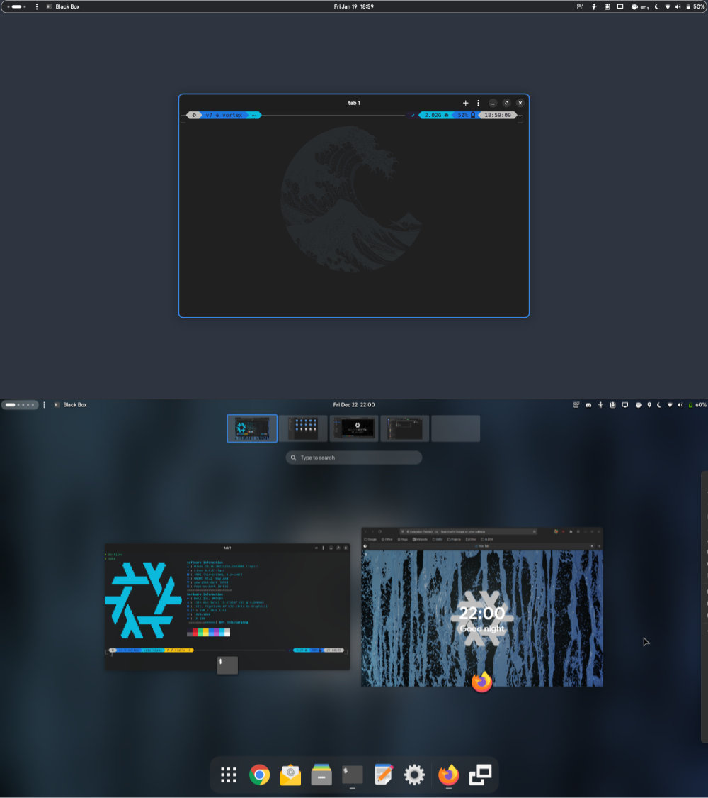
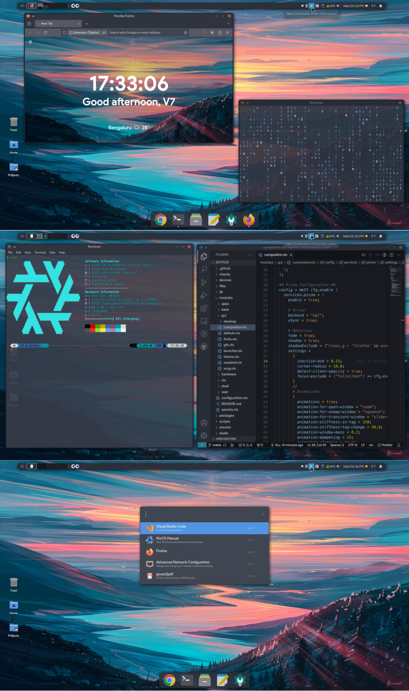

<picture>
  <source media="(prefers-color-scheme: light)" srcset="files/images/logo/light.png"/>
  <source media="(prefers-color-scheme: dark)" srcset="files/images/logo/dark.png"/>
  
</picture>

   [](https://nixos.org)

This [repository](https://github.com/maydayv7/dotfiles) contains the configuration and `dotfiles` for my continuously evolving multi-PC setup (using [Nix](https://nixos.org/)). All the devices I own, controlled by code. It also builds and deploys my website to [maydayv7.tk](https://maydayv7.tk). You can follow along with my [NixOS Desktop](https://maydayv7.tk/series/nixos-desktop/) Series



<details>
<summary><i>More...</i></summary>




[](https://www.reddit.com/r/unixporn/comments/ssb7mf/gnome_my_dream/)

</details>

## Features


- Device-Agnostic
- Convenient and Automated
- Hermetically Reproducible
- Declarative and Derivational
- Atomic, Generational and Immutable

#### Notable Features

- Supports multiple users and devices
- Configuration for multiple Desktop Environments
- Incorporates PipeWire, Wayland, ...!
- Automatically builds and deploys my [Website](./site)
- Authentication Credentials Management using the [`sops`](https://github.com/Mic92/sops-nix) Module and [`gnupg`](https://gnupg.org/) Keys
- Comprehensive User Configuration using the tightly integrated [`home-manager`](https://github.com/nix-community/home-manager) module, with [support](./modules/user/default.nix) for configuring shared user configuration, global conditionals and user-specific configuration
- Ephemeral, Opt-In File System State using the [`impermanence`](https://github.com/nix-community/impermanence) module and [ZFS](https://zfsonlinux.org/)
- Support for Secure Boot using [`lanzaboote`](https://github.com/nix-community/lanzaboote)
- Support for Multiple Programming Language Development [`shells`](./shells) integrated with [`direnv`](https://direnv.net/) and [`lorri`](https://github.com/nix-community/lorri)
- Auto-Magic using [`flake-utils-plus`](https://github.com/gytis-ivaskevicius/flake-utils-plus) helper functions
- Automatic `packages` Updates using [`update.sh`](./packages/update.sh)
- Install Media and Device Images using [`nixos-generators`](https://github.com/nix-community/nixos-generators) image generation modules
- Syntax [Formatting](./modules/nix/format.nix) using [`treefmt`](https://github.com/numtide/treefmt) and [`treefmt-nix`](https://github.com/numtide/treefmt-nix)
- Support for `source` filters with [`nix-filter`](https://github.com/numtide/nix-filter)
- Support for Base16 color theming using [`stylix`](https://github.com/danth/stylix)
- Support for declaratively installing [Flatpak](./modules/apps/flatpak.nix) applications using [`nix-flatpak`](https://github.com/gmodena/nix-flatpak)
- Wrapped `wine` [Applications](./packages/wine) using Emmanuel's [Wrapper](https://github.com/emmanuelrosa/erosanix/tree/0dabea58d483e13d2de141517cb4ff1cb230b2aa/pkgs/mkwindowsapp)
- Support for Android Virtualisation using [Waydroid](https://waydro.id/)
- Declaratively Configured [Windows VM](./devices/vm/Windows.nix) using the [WFVM](https://git.m-labs.hk/M-Labs/wfvm) module

## Programs

| Type                 |                                                         Programs                                                         |
| :------------------- | :----------------------------------------------------------------------------------------------------------------------: |
| Editors              |                    [`nano`](https://www.nano-editor.org/), [VS Code](https://code.visualstudio.com/)                     |
| Shells               |                        [`bash`](https://www.gnu.org/software/bash/), [`zsh`](https://www.zsh.org)                        |
| Terminal             | [Blackbox](https://gitlab.gnome.org/raggesilver/blackbox), [`xfce4` Terminal](https://docs.xfce.org/apps/terminal/start) |
| Browser              |                                    [Firefox](https://www.mozilla.org/en-US/firefox/)                                     |
| Desktop Environments |                                [GNOME](https://www.gnome.org), [XFCE](https://xfce.org/)                                 |

## Structure

**_Overview of File Hierarchy_**

<details>
<summary><b>Outputs</b></summary>

```shellsession
$ nix flake show
github:maydayv7/dotfiles
├───apps
│   └───x86_64-linux
│       ├───default: app
│       └───nixos: app
├───channels: package repositories
├───checks
│   └───x86_64-linux
│       ├───Device-gnome: derivation 'nixos-rebuild'
│       ├───Device-xfce: derivation 'nixos-rebuild'
│       └───treefmt: derivation 'treefmt-check'
├───devShells
│   └───x86_64-linux
│       ├───cc: development environment 'C'
│       ├───default: development environment 'devShell'
│       ├───format: development environment 'Formatter'
│       ├───java: development environment 'Java'
│       ├───lua: development environment 'Lua'
│       ├───python: development environment 'Python'
│       ├───rust: development environment 'Rust'
│       ├───video: development environment 'Video'
│       └───website: development environment 'Website'
├───files: 'dotfiles' and program configuration
├───formatter
│   └───x86_64-linux: package 'treefmt'
├───installMedia: device install media
├───legacyPackages
│   └───x86_64-linux: omitted (use '--legacy' to show)
├───lib: utility library functions
├───nixosConfigurations
│   ├───futura: NixOS configuration
│   └───vortex: NixOS configuration
├───nixosModule: NixOS module
├───nixosModules
│   ├───apps: NixOS module
│   ├───base: NixOS module
│   ├───gui: NixOS module
│   ├───hardware: NixOS module
│   ├───nix: NixOS module
│   ├───secrets: NixOS module
│   ├───shell: NixOS module
│   └───user: NixOS module
├───overlays
├───packages
│   └───x86_64-linux
│       └───nixos: package 'nixos'
├───templates
│   └───default: template: My NixOS Configuration
└───vmConfigurations
    └───Windows: Virtual Machine
```

- `checks`: custom configuration checks
- `channels`: configured system package repositories

</details>

```
┌── flake.nix
├── flake.lock
├── files
├── site
├── devices
│   ├── systems.nix
│   └── vm
├── users
├── secrets
├── shells
├── checks
├── lib
│   ├── build.nix
│   ├── map.nix
│   └── pack.nix
├── scripts
│   ├── install.nix
│   └── nixos.nix
├── packages
│   └── overlays
└── modules
    ├── configuration.nix
    ├── apps
    ├── base
    ├── gui
    ├── hardware
    ├── nix
    ├── shell
    └── user
        └── passwords
```

- `flake.nix`: toplevel configuration file and repository version control  
  [`flake-parts`](https://github.com/hercules-ci/flake-parts) is used for modularization

- [`files`](./files/README.md): `dotfiles` and program configuration
- [`site`](./site/README.md): personal website generated using [`zola`](https://www.getzola.org/)
- [`devices`](./devices/README.md): system configuration for various devices
- `systems.nix`: list of supported system architectures
- [`vm`](./devices/vm/README.md): declarative configuration to build multiple virtual machines
- [`users`](./users/README.md): individual user-specific configuration
- [`secrets`](./secrets/README.md): authentication credentials management using [`sops-nix`](https://github.com/Mic92/sops-nix)
- `shells`: sand-boxed shells for development purposes
- `checks`: configuration checks and continuous integration
- [`lib`](./lib/README.md): custom functions designed for conveniently defining configuration
- [`scripts`](./scripts/README.md): useful system management scripts
- [`packages`](./packages/README.md): locally built custom packages
- `overlays`: overrides for pre-built packages
- [`modules`](./modules/README.md): custom configuration modules for additional functionality
- `configuration.nix`: builds system configuration

## Installation

<details>
<summary><b>Already Installed</b></summary>

In case you want to use my configuration as-is for a fresh NixOS install, you can try the following steps:

**_Note:_** You can run `nix develop` in the repository to install all required dependencies

1. Prepare `/etc/nixos`: <pre><code>sudo mkdir /etc/nixos
   sudo chown $USER /etc/nixos && sudo chmod ugo+rw /etc/nixos
   cd /etc/nixos
   </code></pre>

2. Clone this repository (and preferably initialize it using `git`): <pre><code>nix flake init -t github:maydayv7/dotfiles
   git init
   </code></pre>

3. Install `gnupg` and generate a GPG Key for yourself (if you don't already have one), and include it in the [`secrets.yaml`](./secrets/secrets.yaml) file (using `gpg --list-keys`). You can use the following commands to generate the GPG key (Ultimate trust and w/o passphrase is preferred):  
   _Replace_ **_USER_** _,_ **_EMAIL_** _and_ **_COMMENT_** <pre><code>gpg --full-generate-key
   1
   4096
   0
   y
   <b><i>USER
   EMAIL
   COMMENT</i></b>
   O
   gpg --output public.pgp --armor --export <b><i>USER</i></b>@<b><i>EMAIL</i></b>
   gpg --output private.pgp --armor --export-secret-key <b><i>USER</i></b>@<b><i>EMAIL</i></b>
   </code></pre>
   _Save the keys `public.gpg` and `private.gpg` in a secure location_

4. Import all required GPG Keys into a convenient location (like `/etc/gpg`) using <code>gpg --homedir <i>DIR</i> import</code> and specify it at `config.sops.gnupg.home` (Required for decryption of `secrets` on boot, can also be on an external drive)

5. Make new `secrets` and `passwords` in the desired directories by appending the paths to `secrets.yaml` and then using the following command (The [`nixos`](./scripts/README.md) script can be used to simplify the process):  
   _Replace_ **_PATH_** _with the path to the `secret`_ <pre><code>sops --config <i>/path/to/<b>secrets.yaml</b></i> -i <b><i>PATH</i></b></code></pre>

6. Add device-specific configuration by creating a new file in [`devices`](./devices) (bear in mind that the name of the file must be same as the `HOSTNAME` of your device), and if required, hardware configuration using the `hardware.modules` option

7. Finally, run `nixos-rebuild switch --flake /etc/nixos#HOSTNAME` (as `root`) to switch to the configuration!

</details>

<details>
<summary><b>From Scratch</b></summary>

Download the latest NixOS `.iso` from the [Releases](../../releases/latest) page and burn it to a USB using a flashing utility such as [Etcher](https://www.balena.io/etcher/)

**_Important:_** In order to directly use the configuration, you must first create a clone of this repository and follow steps 2 to 6 from the above section, and preferably upload it to a hosting platform like GitHub/GitLab

<details>
<summary><i>Additional Install Media</i></summary>

If Nix is already installed on your system, you may run the following command to build the Install Media:  
_Replace_ **_VARIANT_** _with the name of Install Media to create_

<pre><code>nix build github:maydayv7/dotfiles#installMedia.<b><i>VARIANT</i></b>.config.system.build.isoImage</code></pre>

You can also download the NixOS `.iso` from [here](https://nixos.org/download.html) and run the `install` script using the following command:

```
nix build github:maydayv7/dotfiles#install
sudo ./result/bin/os-install
```

If you want to create an `.iso` image of the entire system, run the following command:  
_Replace_ **_DEVICE_** _with the name of Device to build_

<pre><code>nix run github:nix-community/nixos-generators -- -f iso --flake github:maydayv7/dotfiles#<b><i>DEVICE</i></b></code></pre>

</details>

#### Partition Scheme

_Note that the `install` script automatically creates and labels all the required partitions, so it is recommended that only the partition table on the disk be created and have enough free space_

| Name           | Label  | Format | Size (minimum) |
| :------------- | :----: | :----: | :------------: |
| BOOT Partition |  ESP   |  vfat  |      500M      |
| ROOT Partition | System |  ZFS   |      25G       |
| SWAP Area      |  swap  |  swap  |       4G       |
| DATA Partition | Files  |  ZFS   |      10G       |

> **Note:**
> For the `advanced` filesystem scheme only

#### Procedure

To install the OS, just boot the Live USB and run `sudo os-install`  
_If the image doesn't boot, try disabling the `secure boot` and `RAID` options from `BIOS`_  
After the reboot, run `nixos setup` to finish the install  
_In case you are using the `advanced` filesystem scheme, you may need to set the boot flag `zfs_force=1` on first boot_

</details>

<details>
<summary><b>Build It Yourself</b></summary>

If you really want to get dirty with Nix and decide to invest oodles of your time into building your own configuration, this repository can be used as inspiration. You can check out the list of links below to resourceful Nix documentation/tutorials/projects that may be helpful in your endeavour

**Welcome** to the Nix Community! ;)

</details>

## Notes

### Caution

I am pretty new to Nix, and my configuration is still _WIP_ and uses Nix [Flakes](https://nixos.wiki/wiki/Flakes), an experimental feature (**Important:** Nix >= 2.19)

It is not recommended to use NixOS if you are a beginner just starting out, without acquaintance with either the command-line or functional programming languages, since the learning curve is steep, debugging issues is difficult, documentation is shallow, and the effort required/time spent isn't worth the hassle for a novice/casual user

### Requirements

_May change according to available hardware_

- UEFI Compatible System
- Intel CPU + iGPU

See [this](./modules/hardware/README.md) for additional hardware information

### Build

While rebuilding system with Flakes, make sure that any file with unstaged changes will not be included. Use `git add .` in cases where the `git` tree is dirty

#### Branches

There are two branches, [`stable`](../../tree/stable) and [`develop`](../../tree/develop) (when required). The `stable` branch consists of configuration that builds without failure, and the `develop` branch is a bleeding-edge testbed

#### Cache

The system build cache is publicly hosted using [Cachix](https://www.cachix.org) at [maydayv7-dotfiles](https://app.cachix.org/cache/maydayv7-dotfiles), and can be used while building the system to prevent rebuilding from scratch

#### Continuous Integration

This repository makes use of [`GitHub Actions`](./checks/github/workflows) in order to automatically check the configuration syntax on every commit (using and [`statix`](https://github.com/nerdypepper/statix)) and format it (using [`treefmt`](https://github.com/numtide/treefmt)), update the `inputs` every week, build the configuration and upload the build cache to [Cachix](https://app.cachix.org/cache/maydayv7-dotfiles) as well as publish the Install Media `.iso` to a draft Release upon creation of a tag (You can also find `GitLab CI/CD` configuration in [`.gitlab`](./checks/gitlab/.gitlab-ci.yml)). A `git` [hook](./.git-hooks) is used to check the commit message to adhere to the [`Conventional Commits`](https://www.conventionalcommits.org) specification

###### Variables

- [`ACCESS_TOKEN`](./secrets/github-token.secret): Personal Access Token (To create one - [GitHub](https://docs.github.com/en/authentication/keeping-your-account-and-data-secure/creating-a-personal-access-token), [GitLab](https://docs.gitlab.com/ee/user/profile/personal_access_tokens.html))
- [`CACHIX_TOKEN`](./secrets/cachix-token.secret): Cachix Authentication Token

### Home Manager

The [`home-manager`](https://github.com/nix-community/home-manager) module is used in tandem with the system configuration in order to define user-specific configuration. The `config.user.home` option has been declared in [`modules/user/default.nix`](./modules/user/default.nix) independent of the original module, from which the final configuration is built, in order to prevent infinite recursion while configuring multiple users per system. The system `config` can be accessed using the `sys` parameter in `home-manager` modules

## Links

### Theming

- [Neofetch](https://github.com/dylanaraps/neofetch): Snazzy CLI System Information Tool
- [Powerlevel10K](https://github.com/romkatv/powerlevel10k) Theme: ZSH Theme for the fancy-looking prompt with immense customization capabilities
- [Arc Theme](https://github.com/jnsh/arc-theme): Flat GTK theme with transparent elements for various desktop shells, window managers and applications
- [Bibata Cursor](https://github.com/ful1e5/Bibata_Cursor): Compact and material designed cursor set
- [DNOME](https://github.com/GeopJr/DNOME) Discord Theme: Discord theme inspired by Adwaita, designed to integrate Discord with GNOME
- [Firefox GNOME Theme](https://github.com/rafaelmardojai/firefox-gnome-theme): GNOME Theme for the Mozilla Firefox Browser, used for better desktop integration
- [VS Code Adwaita Theme](https://github.com/piousdeer/vscode-adwaita): Integrates Visual Studio Code with GNOME Desktop
- [KvLibadwaita Kvantum Theme](https://github.com/GabePoel/KvLibadwaita): Integrates QT Apps with GNOME Desktop

### Important Links

**See:** A [Curated List](https://github.com/nix-community/awesome-nix) of the Best Resources in the Nix Community

- Official [Documentation](https://nixos.org/learn.html)
- NixOS [Manual](https://nixos.org/manual/nixpkgs/stable)
- Nix [Pills](https://nixos.org/guides/nix-pills/)
- NixOS [Discourse](https://discourse.nixos.org/)
- NixOS [Package Search](https://search.nixos.org/)
- [`nixpkgs`](https://github.com/NixOS/nixpkgs) Package Repository
- [NUR](https://github.com/nix-community/NUR) Nix User Repository
- NixOS [Hardware Modules](https://github.com/nixos/hardware)
- Home Manager [Options](https://nix-community.github.io/home-manager/options.html)

#### Other Sources

- Tweag [Article](https://www.tweag.io/blog/2020-05-25-flakes/) introducing Flakes
- Serokell's [Blog](https://serokell.io/blog/practical-nix-flakes) on Flakes
- Jordan Isaac's [Blog](https://jdisaacs.com/series/nixos-desktop/) for porting configuration to Flakes
- Jon Ringer's [Videos](https://www.youtube.com/channel/UC-cY3DcYladGdFQWIKL90SQ) on General NixOS Tooling and Hackery
- Justin's [Notes](https://github.com/justinwoo/nix-shorts) on using Nix
- Lan Tian's Series of [Blog Posts](https://lantian.pub/en/article/modify-website/nixos-initial-config-flake-deploy.lantian/) on NixOS
- Christine's [Blog Posts](https://christine.website/blog/series/nixos) addressing NixOS Security
- [Graham](https://grahamc.com/blog/erase-your-darlings) and [Elis'](https://elis.nu/blog/2020/05/nixos-tmpfs-as-root/) Blog Posts on Ephemeral Partition Schemes

#### Other Configurations

Here are some repositories that I may have shamelessly rummaged through for building my `dotfiles`:  
_Thanks a lot! ;)_

- Example [Configuration](https://github.com/srid/nixos-flake)
- User Configurations -
  - [balsoft](https://code.balsoft.ru/balsoft/nixos-config)
  - [bbigras](https://github.com/bbigras/nix-config)
  - [cole-h](https://github.com/cole-h/nixos-config/)
  - [colemickens](https://github.com/cole-mickens/nixcfg)
  - [davidtwco](https://github.com/davidtwco/veritas)
  - [fufexan](https://github.com/fufexan/dotfiles)
  - [gvolpe](https://github.com/gvolpe/nix-config)
  - [hlissner](https://github.com/hlissner/dotfiles)
  - [jordanisaacs](https://github.com/jordanisaacs/dotfiles)
  - [kclejeune](https://github.com/kclejeune/system)
  - [lovesegfault](https://github.com/lovesegfault/nix-config)
  - [lucasew](https://github.com/lucasew/nixcfg)
  - [nobbz](https://github.com/NobbZ/nixos-config)
  - [rasendubi](https://github.com/rasendubi/dotfiles)
  - [sloodmy](https://github.com/sioodmy/dotfiles)
  - [tejing1](https://github.com/tejing1/nixos-config)
  - [vlaci](https://github.com/vlaci/nixos-config)
  - [wiltaylor](https://github.com/wiltaylor/dotfiles)

---

You can navigate to the `README`s present in the various directories to know more about them

<details>
<summary><b>Changelog</b></summary>

### v15

- Use the [`flake-parts`](https://flake.parts/) Flakes framework
- Improve Syntax Formatting with `treefmt-nix` and drop `pre-commit-hooks`
- Support declarative [Flatpak](https://flatpak.org/) application install
- Update Nix to version 2.19
- Enable Security & Hardening settings by default
- Support Secure Boot using [`lanzaboote`](https://github.com/nix-community/lanzaboote)
- Allow patching Default Package Channel
- Separate `games` and `laptop` module
- Separate `install` Script
- Show package delta using [`nvd`](https://gitlab.com/khumba/nvd)
- Upgrade to GNOME 45
  - Update Extensions
- Fix Emoji Support
- Drop `.templates`
- Multiple Refactors

### v13

- Follow NixOS Unstable
- Improve `nix-index`
- Move out proprietary files
- Refactor Secrets
- Drop `deploy-rs` Support
- Remove `inputs` patching Support
- Fix first boot installation
- Add conditional to `lib.map.files`
- Add `gui.{wallpaper,wayland}`

### 23.05 (v12)

- Upgrade to NixOS v23.05 (Stoat)!
- Drop `cod`, `nix-linter`, `gedit`, `touchegg`, `vscode-server` and `mutter-rounded`
- Support Android Virtualisation using Waydroid
- Drop `compat` Libraries
- Refactor GNOME Experience
  - Use `blackbox` as default terminal
  - Use [`forge`](https://github.com/forge-ext/forge) for tiling
  - Add keyboard shortcuts window using [`shortcuts`](https://gitlab.com/paddatrapper/shortcuts-gnome-extension)
- Improve XFCE Configuration and Handling
- Improve Automatic Package Update Script
- Enable ZFS encryption
- Support Network Printing

### 22.11 (v11)

- Upgrade to NixOS v22.05 (Quokka)!
- Add `lib.map.array`
- Improve `nixos` Script
- Add `gui.fonts.usershare`
- General Maintenance Updates
- Use [`treefmt`](https://github.com/numtide/treefmt) for Formatting Code

### 22.04 (v10)

- Deprecate `git-crypt` Usage
- Improve Installation Experience
- Begin Work on Blog
- Stabilize with multiple Bug-Fixes

<details>
<summary><i>Archive</i></summary>

### v7.0

- Create Website using [Zola](https://www.getzola.org/)
- Refine Compatibility Libraries
- Refine Scripts
  - Use `nix-shell` Shebangs
  - Add `lib.build.script`
- Support Visual Studio Code Editor
- Use [`alejandra`](https://github.com/kamadorueda/alejandra) for formatting code

### v5.0

- Improve `channels` Usage
- Support `source` Filters
- Refine `git` Configuration
- Use `wine` Application Wrapper
- Use System Independent `library`
- Add Support for Ephemeral `/home`
- Add Configuration for [XFCE](https://xfce.org/) Desktop
- Bifurcate `users` and Refine User Configuration
- Support Automatic `packages` Updates using `update.sh`
- Add Support for Automatic Deployments using [`deploy-rs`](https://github.com/serokell/deploy-rs)
- Add Developer `shells` for Multiple Programming Languages integrated with [`lorri`](https://github.com/nix-community/lorri)

### v4.5

- Use Calendar Versioning
- Use `nixConfig`
- Support Auto-Upgrade
- Support Multiple Users per Device
- Improve Security and Harden System
- Use PipeWire (with low-latency) for audio
- Use [`nixos-generators`](https://github.com/nix-community/nixos-generators) for Image Generation

### v4.0

- Use `nixConfig`
- Bifurcate `devices`
  - Refactor `lib.build.system` into `build.iso` and `build.device`
- Improve `lib` Handling
- Improve Module Imports
- Improve and Bifurcate `docs`
- Handle `scripts` as packages
- Improve configuration `checks`
- Achieve `system` Independence
- Add `.editorconfig` and `nanorc`
- Refactor `sops` Encrypted Secrets
- Stabilise and document `templates`
- Fix `devshells`, `repl` and `scripts`
- Fix Module Imports and `inputs` Patching
- Improve Mime Types Handling with `lib.xdg`
- Use `advanced` Ephemeral Root File System Layout with [ZFS](https://zfsonlinux.org/)
- Use [`flake-compat`](https://github.com/edolstra/flake-compat), [`nix-gaming`](https://github.com/fufexan/nix-gaming) and [`nix-wayland`](https://github.com/nix-community/nix-wayland)
- Improve Code Consistency, reduce Complexity and fix Syntactic and Semantic Errors

  - Use [`pre-commit-hooks`](https://github.com/cachix/pre-commit-hooks.nix) to improve configuration `checks`
  - Use [`nixfmt`](https://github.com/serokell/nixfmt) for formatting code
  - Use [`nix-linter`](https://github.com/Synthetica9/nix-linter) to check stylistic errors

### v3.0

- Upgrade to NixOS v21.11 (Porcupine)!
- Improve Package Declaration
- Add Support for Instant Nix REPL
- Add Support for patching `inputs`
- Improve usage of Developer Shells
- Import Modules using `nixosModules`
- Use [`home-manager`](https://github.com/nix-community/home-manager) as a Module
- Merge Device and User Configuration
- Move all program configuration and dotfiles to `files`
- Use [`sops-nix`](https://github.com/Mic92/sops-nix) at `secrets` for managing authentication credentials
- Automatically map `modules`, `packages`, `overlays`, `shells` and `inputs`

### v2.3

- Add `docs` directory
- Fix `.iso` Boot and Install Errors
- Improve Scripts with error-checking
- Add `direnv` support at `shells`
- Add Support for Nix Developer Shells at `shells`
- Use `secrets` as an `input` rather than as a `submodule`
- Improve CI with automatic `flake.lock` update and dependency-checking
- Bifurcate Flake `outputs` (as `configuration.nix`), `scripts` and `overlays`

### v2.1

- Simplify Installation
  - Add `install` Script
  - Add Support for creating Install Media
  - Add overhauled `setup` Script
  - Automatically build `.iso` and publish release using CI
- Fix Home Activation

### v2.0

- Add BTRFS (opt-in state) Configuration
- Improve Ephemeral Root Support with [impermanence](https://github.com/nix-community/impermanence)
- Improve Installation Experience
- Improve Home Activation
- Bifurcate Modules and Roles
- Reduce CI Time
- Add the Office role

### v1.0

- Add Cachix Support
- Add Nix Shell Support
- Increase Readability
- Improve Package Management
- Under the hood CI changes

### v0.7

- Improve Secrets Management using Private Submodule at `secrets`
- Overhaul Package Overrides
  - Use `final: prev:` instead of `self: super:`
  - Add support for NUR
  - Split System Scripts and import as overlay
  - Refactor Package Overrides into `packages`
- Add archived `dotfiles` and revitalize existing ones
- Improve Modulated Imports
- Improve Fonts Management
- Update README and `scripts`

### v0.5

- Added Support for Nix Flakes
- Added Custom Libraries for Device and User Management
- Created System Management Script
- Updated README and `install` Script
- Add full support for Multi-Device Configuration
- Use Better Repository Management

### v0.1

- Added basic NixOS system configuration using GNOME and GTK+
- Added hardware support for 2 devices
- Added `setup` script
- Added `home-manager` support and user dotfiles
- Added Modulated Configuration
- Added Support for Nix User Repository
- Added Repository Pinning
- Added Essential Package Overlays
- Added Basic Password Management
- Added README

</details>

</details>

<details>
<summary><b>Known Limitations</b></summary>

- It is a hard requirement to clone the repository to `/etc/nixos` in order to use it as intended
- Home Configuration can't be decoupled from System
- Lack of automatic script checking
- Currently using a workaround for CI due to NixOS/nix#3978

#### Manually Managed Packages

- VS Code Themes and Plugins
- [Wine](./packages/wine) Applications

</details>

> Last Updated: **December** 2023

If you like this project, consider leaving a [star](https://github.com/maydayv7/dotfiles)

**V 7**  
<maydayv7@gmail.com>
