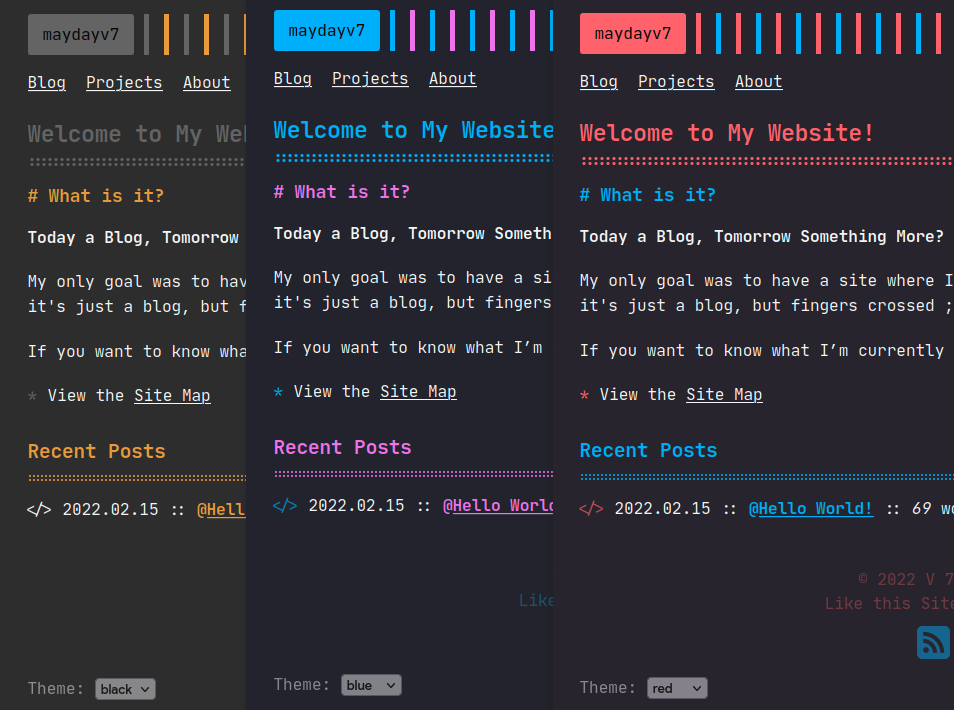

## My Personal Website

[](https://maydayv7.tk)

Generated using [Zola](https://www.getzola.org/) and Deployed with [Nix](https://nixos.org/), [GitHub Pages](https://pages.github.com/) and [Netlify](https://netlify.com)

Hosted at [maydayv7.tk](https://maydayv7.tk)

### Build

You can grab all the required dependencies using `nix develop github:maydayv7/dotfiles#website` or `nix-shell`

For testing, run the following commands:

```
zola -r site check
zola -r site serve
```

Then click [here](http://localhost:1111)

To build the site, run `nix build`. In order to override the Base URL, <code>nix-build -E "with import ./.; callPackage ./site { site = <b><i>URL</i></b>; }"</code> can be used

#### Continuous Integration

[`GitHub Actions`](../checks/github/workflows/website.yml) is used in order to automatically build the site and publish it to the main domain using GitHub Pages. [Netlify](https://netlify.com) automatically deploys to [maydayv7.netlify.app](https://maydayv7.netlify.app) on every commit and allows for PR previews

### Features

- [x] Pagination
- [x] Categories
- [x] Social Links
- [x] Search
- [x] Analytics
- [x] Comments using [Disqus](https://disqus.com/)/[Giscus](https://giscus.app/)
- [x] Theme Switcher
- [x] Syntax Highlighting Theme
- [x] [KaTeX](https://katex.org/) Support -
  - Inline : `\\( \KaTeX \\)` / `$ \KaTeX $`
  - Block-Style : `\\[ \KaTeX \\]` / `$$ \KaTeX $$`
- Shortcodes -
  - [x] URL : <code>{{ url(path="<b>LINK</b>", text="<b>NAME</b>") }}</code>
  - [x] Image : <code>{{ image(src="<b>PATH</b>", alt="<i>Alternative Text</i>", position="<i>left</i>", style="<i>border-radius: 8px;</i>") }}</code>
  - [x] Figure : Extends Image - <code>{{ figure(caption_position="<i>left</i>", caption="<b>CAPTION</b>", caption_style="<i>font-weight: bold;</i>") }}</code>
  - [x] GitHub : Star Count - <code>{{ github(repo="<b>USER</b>/<b>NAME</b>") }}</code>
  - [x] YouTube : Embed Video - <code>{{ youtube(id="<b>ID</b>") }}</code>
  - [x] Vimeo : Embed Video - <code>{{ vimeo(id="<b>ID</b>") }}</code>

#### Credits

Huge thanks to:

- [zerm](https://github.com/ejmg/zerm) for the theme
- [jdisaacs.com](https://github.com/jordanisaacs/jdisaacs.com) for the basic repository structure
